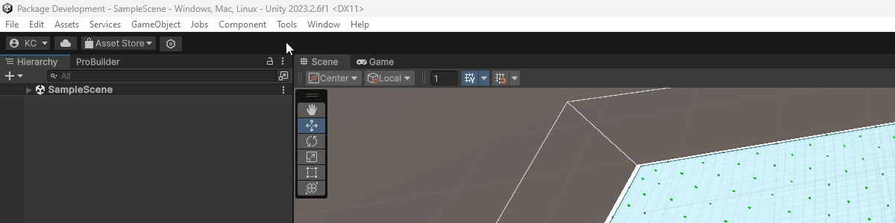
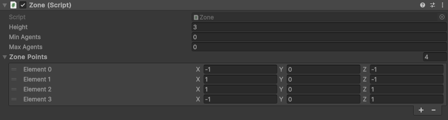
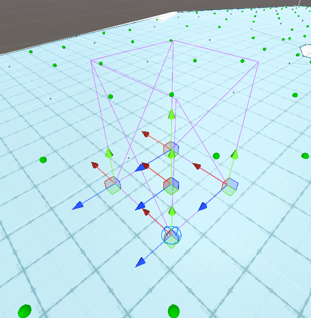
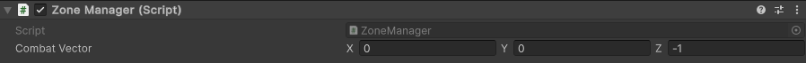

# Getting Started with the Post Navigation System in Unity
This is a quick guide on how to get up and running with the Post Navigation System using components that come ready to use in the package

### Prerequisites
- You have Unity 2023 installed
- You have installed the Post Navigation System package by following the download instructions in the repository's readme
- You understand how to use Unity's NavMesh system and can create a NavMesh and use NavMeshAgents

### Generating post data from the navmesh


Generating post data can be done within the Unity editor. It will serialize all the post data and save it inside a scriptable object in your scenes folder. To generate post data from the NavMesh, go to the "Tools" option in the menu bar at the top of the application and find the Navigation section. As a sub option there is a button to "Generate Posts from NavMesh". Clicking this will run the post generator for generating posts from the navmesh and save the data in that scriptable object called Posts.

### Creating a Post Selector
Post selectors are pure C#, meaning they are not created in unity but instead in script. You can construct a post selector using the PostSelector constructor and populate it with post rules and an array of posts to run on. Here is an example of a post selector that will find a post that is nearby, has line of sight to a target as well as be in cover from the target and is not occupied. This particular post selector will use an agent's zone as the post pool to run the rules on:
```csharp
PostSelector postSelector = new PostSelector(
    new List<IPostRule>{
        new IsNotOccupied(this),
        new IsInCover(Target, 1f),
        new HasLineOfSight(Target, 1.5f, 5f, false),
        new DistanceToTarget(transform, 1f, true)
    },
    (origin) => ZoneManager.Instance.GetPostsForAgent(this)
);
```
**Be sure to reference the [API reference docs](./APIReference/README.md) if you're unsure on what any of the constructor values are!**

The post selector can then be ran like so:
```csharp
// Run the post selector
var postSelectorScores = postSelector.Run(transform.position);

// Get the best post from the post selector
IPost bestPost = postSelectorScores.GetBestPost();
```

### Using the Post Manager
When you have got the best post from the post selector and you want to occupy that post, it might be a good idea to tell the post manager that you are going to occupy it. The `IsNotOccupied` rule relies on you to do this!
```csharp
// We are going to occupy the post so tell the post manager
PostManager.Instance.OccupyPost(bestPost, this);
```

The post manager is a singleton so the first access of the instance will initialise it and all subsequent accesses to the instance will reference the original.

**Note**: To use the post manager (and the zone manager) your agent that is occupying a zone must implement the [IPostAgent](./APIReference/Pages/Interfaces/IPostAgent.md) interface!

### Using Zones


A powerful tool in any game designers arsenal are zones. Zones give game designers a finer control on what agents should do in a level. To create a zone, create an empty game object in your scene and add the Zone component. By default, the zone component will have a minimum and maximum of 0 agents, a height of 3 units and define 4 points in a square.

In your editor window you will see 5 handles, one in the center which is the game objects handle, this is the origin of the zone. This is not particularly important but if you move the origin then all the points defining the zone will move with it. You can move the 4 points of the zone using the other 4 handles.



You may also notice a blue sphere around one of the zone's points. This indicates the last point in the zone. This is useful for adding points. In the inspector window you can add a zone point to the list of ZonePoints. This will produce a point at the last point in the list which is where the blue circle is. You can then use the handle to move the zone. A magenta mesh is generated around the zone to indicate the zones bounds. Any posts within these bounds will be part of the zone's posts.

Next you will want to change the minimum and maximum agents you want to be able to be assigned to the zone. As specified in the [ZoneManager API reference docs](./APIReference/Pages/ZoneManager.md), the zone manager will ensure that the minimum and maximum agents are respected.

Once you have placed all the zones in your scene, we can move onto using the zone manager.

### Using the Zone Manager


Zones are useless without the use of the zone manager. The zone manager inherits `monobehaviour` so it must be attached to a game object. So lets create another empty game object and add the ZoneManager component. There is only one exposed property in the inspector and that is the combat vector. More details on what the combat vector is is available in the [ZoneManager API reference docs](./APIReference/Pages/ZoneManager.md). For now, we want to setup the combat vector to follow the direction of zones in your level. The combat vector should be a normal vector and you can choose to have it point from the back to front for a more defensive agent behaviour to from front to back for a more aggressive agent behaviour.

With the zone manager setup, we can go into our agent script and tell it to request a zone. This can be done via the zone manager singleton like so:
```csharp
// Request the closest zone
Zone zone = ZoneManager.Instance.GetClosestZoneToAgent(this);
ZoneManager.Instance.RequestZone(zone, this);
```

The above code asks the zone manager to get the closest zone to the agent, the agent will then request a zone via the zone manager where the zone manager will follow a set of rules and handle the zone request. More information on how the zone manager handles agents requesting zones can be found in the [ZoneManager API reference docs](./APIReference/Pages/ZoneManager.md).

A helpful part of the [`IPostAgent`](./APIReference/Pages/Interfaces/IPostAgent.md) interface is that it contains a delegate that is called when the agent is assigned to a zone, the delegate will pass the zone it has been assigned to as a parameter. Agent zone assignment can happen because an agent has requested a zone, or because a zone is below the minimum amount of agents specified. We can setup a function call to this delegate like so:
```csharp
// Assign delegate
OnAssignedZone += AssignedToZone;
```

Inside the AssignedToZone function we can then run a post selector to get a post within the zone and move to it using Unity's NavMesh system.

### A basic implementation of a IPostAgent
Here is a full example of an [`IPostAgent`](./APIReference/Pages/Interfaces/IPostAgent.md) that will request the closest zone to it on awake and move to their assigned zone:
```csharp
using System;
using System.Collections.Generic;
using KieranCoppins.PostNavigation;
using UnityEngine;
using UnityEngine.AI;

[RequireComponent(typeof(NavMeshAgent))]
public class ZoneableAgentImpl : MonoBehaviour, IPostAgent
{
    /////////////////////////////
    /// IPostAgent Interface ///
    public Vector3 Position => transform.position;

    public Action<Zone> OnAssignedZone { get; set; }
    /////////////////////////////

    public Transform Target;
    private NavMeshAgent agent;

    void Awake()
    {
        // Assign delegate
        OnAssignedZone += AssignedToZone;

        // Get the nav mesh agent
        agent = GetComponent<NavMeshAgent>();

        // Request the closest zone on awake
        Zone zone = ZoneManager.Instance.GetClosestZoneToAgent(this);
        ZoneManager.Instance.RequestZone(zone, this);
    }

    private void AssignedToZone(Zone zone)
    {
        // Use the post selector to get a post within the zone
        PostSelector postSelector = new PostSelector(
            new List<IPostRule>{
                new IsNotOccupied(this),
                new IsInCover(Target, 1f),
                new HasLineOfSight(Target, 1.5f, 5f, false),
                new DistanceToTarget(transform, 1f, true)
            },
            (origin) => ZoneManager.Instance.GetPostsForAgent(this)
        );

        var postSelectorScores = postSelector.Run(transform.position);

        // Get the best post from the post selector
        IPost bestPost = postSelectorScores.GetBestPost();

        // We are going to occupy the post so tell the post manager
        PostManager.Instance.OccupyPost(bestPost, this);

        // Use unity's nav mesh agent to move to the post
        agent.SetDestination(bestPost.Position);
    }
}
```