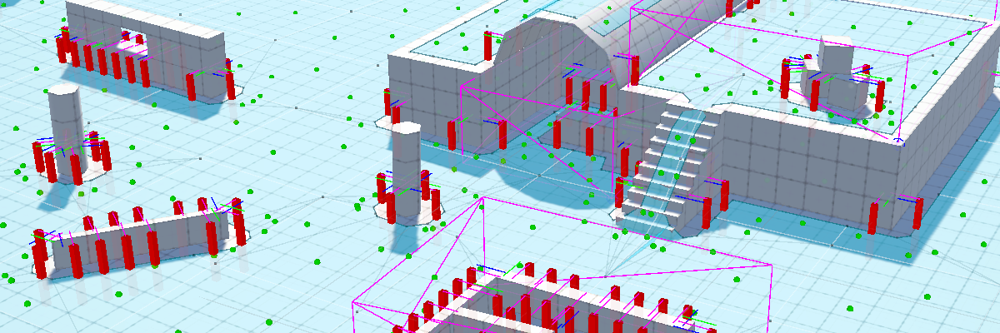
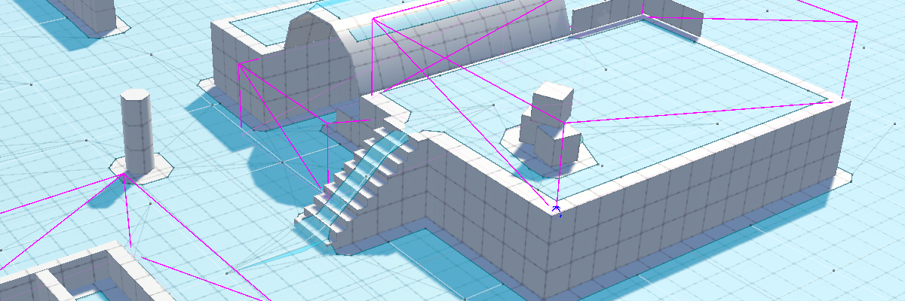
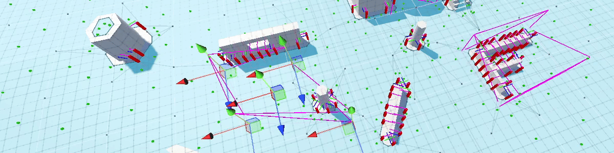

# Post Navigation System
The post navigation system is a package for Unity to allow automatic generation of posts that can be used as points in the world for AI to pathfind to. It also comes with other tools for managing agents in your game.

## Features

### Posts & Post NavMesh Generation


Posts are the points generated in the world that can be evaluated with post selectors to find the best post for the agent's scenario. There are two post types that come ready to use in the package: open and cover posts.

Out of the box, this package allows generation of open and cover posts using Unity's navmesh system. It uses the edges of the navmesh and raycasts to analyse the game environment to place both open and cover posts. These are generated in editor, serialized, then read at runtime.

The generation algorithm uses [edge walking][2] and [raycasts][2] to find points along Unity's NavMesh.

### Zones


Zones are a polygonal area that a game designer can draw. Any posts within the zone's area will be part of the zone. Agents can be assigned to zones and therefore have their post selection limited to posts within the zone. They have a minimum and maximum agent count that a game designer can tweak to make the AI behave how they want.

For example, a game designer might place a zone at the exit of a level and set a minimum amount of agents in the zone. This will mean, if theres agents alive, that they will be assigned to that zone and protect the exit to that level.

This is heavily inspired by a technique that Naughty Dog uses called [hard points][1]. This an extremely simple but powerful tool for any game designer.

### Game Designer Flexibility
Systemic placement of posts is not always the best. Game designers have designed their levels with cover and other post types in mind, thats why you can also hand-place posts that are considered to be the same as ones generated by the navmesh.

### API Reference Documentation
With this package, an extensive [API reference](./Documentation~/APIReference/Index.md) can be found in the documentation breaking down each class and their methods and properties.

### Post Selection & Management


There are two primary managers that come with this package: the Post Manager, which handles storing all the posts in the level at runtime. It stores when agents occupy posts and provides an API for scripters to access post data; and the Zone Manager, which is a singleton monobehaviour in your scene that is in charge of managing the zones that have been placed. It periodically checks the state of each zone and ensures that the minimum and maximum agents in the zone are always being abided by.


### Unity Editor Integration


Creating zones has been made easy thanks to its editor integration. When creating a zone, it will default with 4 points. Each point has a drawing handle that a game designer can place wherever they want the zone's bounds to be. More points can be added and removed as the designer needs them.

## Package Installation

There are three methods of installing this package: downloading manually, downloading with a git url, or downloading by name.

### Download Manually
To download manually, you can:
- Clone this repository locally.
- Open the package manager in Unity.
- Click the "+" icon and click to add package from disc.
- Click on the repository that you have cloned.

You should then see this package in your package manager.

### Download with GitURL
To install with a GitURL, you simply:
- Open the Unity package manager.
- Click the "+" icon and click to add package from git URL.
- Paste the clone link for this repository (`https://github.com/KieranCoppins/Post-Navigation-System.git`).

### Download by Name
To download by name requires a bit of setup. Effectively, I am going to be re-iterating this [forum post](https://forum.unity.com/threads/using-github-packages-registry-with-unity-package-manager.861076/) from step 4.

- First, you need to [log in to the git registry using a personal access token (PAK)](https://docs.github.com/en/packages/working-with-a-github-packages-registry/working-with-the-npm-registry#authenticating-with-a-personal-access-token). This requires npm to be installed, and make sure your PAK has `packages:read` permissions. You can do this by running the command: `npm login --scope=@kierancoppins --registry=https://npm.pkg.github.com` and entering your github username, PAK for password, and your email.

- Next, you will need to do what is discussed [here](https://forum.unity.com/threads/npm-registry-authentication.836308/). This access token should then get placed into the `.npmrc` file inside your user's root (for Windows, this would be `C:/Users/<user>/.npmrc`). Then, inside this same user root location, you need to create a `.upmconfig.toml`. The contents of this file should be:
    ```
    [npmAuth."https://npm.pkg.github.com/@kierancoppins"]

    token = "<AUTH TOKEN  _authToken in .npmrc)>"

    email = "<EMAIL>"

    alwaysAuth = true
    ```

- Next, you need to add a scoped registry to your project's package manifest. This is located in `<project-root>/Packages/manifest.json`. The scoped registry is:
    ```json
    "scopedRegistries": [
        {
            "name": "Github Packages",
            "url": "https://npm.pkg.github.com/@kierancoppins",
            "scopes": [
                "com.kierancoppins"
            ]
        }
    ]
    ```
    **Note**: You can also add other git packages here too, so if by chance you already have some git packages, you can just add `com.kierancoppins` to your git packages' scope.

- You can then choose to add the package to this json by adding `"com.kierancoppins.post-navigation": "^1.0.0"` to the dependencies object of the json, OR by going into the Unity package manager and:
    - Click the "+" icon and click to add package by name.
    - Enter: `com.kierancoppins.post-navigation`. You can also specify a version name, otherwise it will get the latest.

The benefit of doing this is that it's very easy to update this package once it's setup. Since dependencies will be downloaded automatically, you can use the package manager to update this package.

## Remarks
- [Authored vs. Systemic: Finding a Balance for Combat AI in Uncharted 4 - GDC 2017](https://www.youtube.com/watch?v=G8W7EQKBgcg)

[1]: <https://www.youtube.com/watch?v=G8W7EQKBgcg> (Authored vs. Systemic: Finding a Balance for Combat AI in Uncharted 4 - GDC 2017)

- [Cover system in games](https://www.gamedev.net/blogs/entry/2276748-cover-system-in-games)

[2]: <https://www.gamedev.net/blogs/entry/2276748-cover-system-in-games> (Cover system in games)